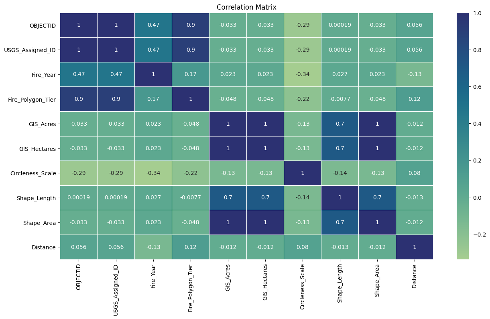
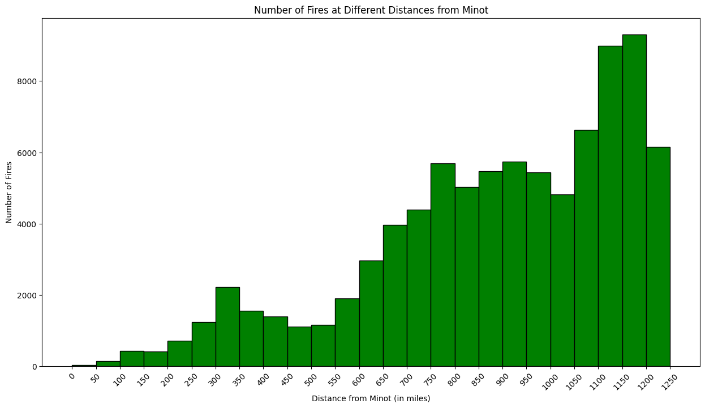
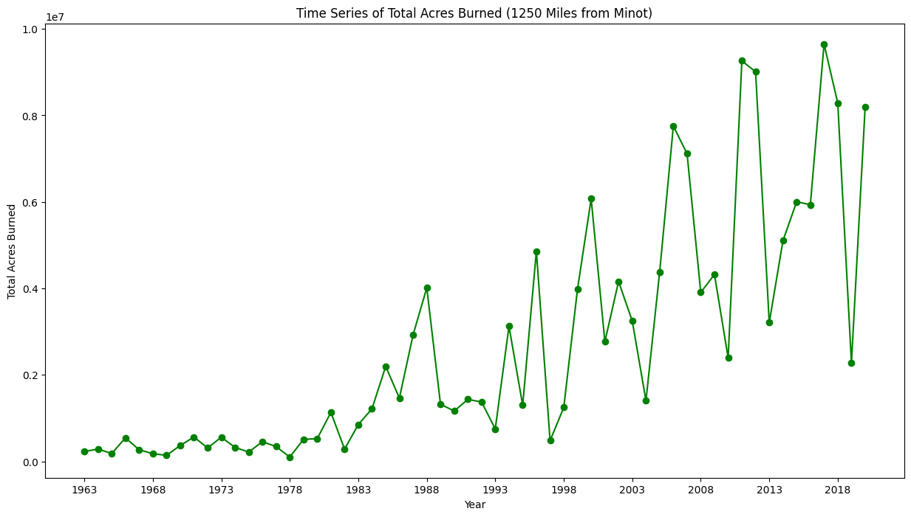
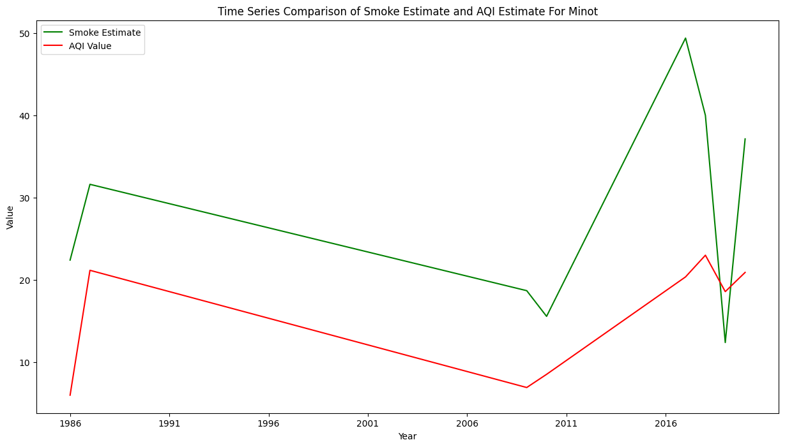

# DATA 512: Human Centered Data Science (Autumn 2023)

## Common Analysis
More and more frequently summers in the western US have been characterized by wildfires with smoke billowing across multiple western states. There are many proposed causes for this: climate change, US Forestry policy, growing awareness, just to name a few. Regardless of the cause, the impact of wildland fires is widespread. There is a growing body of work pointing to the negative impacts of smoke on health, tourism, property, and other aspects of society.
The course project will require that we analyze wildfire impacts on a specific city in the US. The end goal is to be able to inform policy makers, city managers, city councils, or other civic institutions, to make an informed plan for how they could or whether they should make plans to mitigate future impacts from wildfires.

The common research question that we are to answer is:

**What are the estimated smoke impacts on the assigned city (Minot) for the last 60 years?**

We are to create an annual estimate of wildfire smoke in our assigned city. This estimate is just a number that we can eventually use to build a predictive model. Technically, smoke impact should probably be considered the health, tourism, economic or other social problems that result from the smoke. For this we'll generically call our estimate the wildfire smoke impact. We will consider other potential social and economic impacts during Part 2 of the course project. For now, we need some kind of number to represent an estimate of the smoke our city saw during each annual fire season.
Why is this an estimate of fire smoke? These are estimates because of a number of problems that are not easy to resolve and simplifications to make this course project reasonable for just a few weeks of work. One example is that actual smoke impact is based on wind direction over a course of several days, the intensity of the fire, and its duration. However, the fire polygon data only gives a year for each fire - it does not provide specific start and end dates for the fire. 
The smoke estimate should adhere to the following conditions:
- The estimate only considers the last 60 years of wildland fires (1963-2023).
- The estimate only considers fires that are within 1250 miles of the assigned city (Minot - Ward County).
- An annual fire season will run from May 1st through October 31st.


## Data Sources
The following is the data source:
- **USGS_Wildland_Fire_Combined_Dataset.json**: The common analysis research question is based on one specific dataset which can be found at [Combined wildland fire datasets for the United States and certain territories, 1800s-Present (combined wildland fire polygons)](https://www.sciencebase.gov/catalog/item/61aa537dd34eb622f699df81). This dataset was collected and aggregated by the US Geological Survey. The dataset is relatively well documented. Fire polygons are available in ArcGIS and GeoJSON formats. We have been assigned one US city that will form the basis for our individual analysis. We can find our individual US city assignment from [this Google spreadsheet](https://docs.google.com/spreadsheets/d/1cmTW5fgU3KyH6JbrRao-qWjzu2GovKk_BkA7a-poGFw/edit?usp=drive_link).


## Link to licensed sample notebook
The below sample codes were referenced for the following tasks and have been provided under the [Creative Commons](https://creativecommons.org/) [CC-BY license](https://creativecommons.org/licenses/by/4.0/):
- [Sample notebook for Geodetic Distance Computation](https://drive.google.com/file/d/1qNI6hji8CvDeBsnLDAhJXvaqf2gcg8UV/view?usp=sharing)
- [Sample code for accessing the US EPA Air Quality System API](https://drive.google.com/file/d/1bxl9qrb_52RocKNGfbZ5znHVqFDMkUzf/view?usp=sharing)
- [Sample code for GeoJSON reader](https://drive.google.com/file/d/1TwCkvdaw0MxJzW7NSDg6XxYQ0dvaS44I/view?usp=sharing)

## Data files

#### Library installation required
 - pyproj
 - geojson
 - tqdm
 - seaborn
 - matplotlib
 - statsmodels
 - requests

#### Repository tree
```
.
├── .git
│   ├── hooks
│   │   ├── applypatch-msg.sample
│   │   ├── commit-msg.sample
│   │   ├── fsmonitor-watchman.sample
│   │   ├── post-update.sample
│   │   ├── pre-applypatch.sample
│   │   ├── pre-commit.sample
│   │   ├── pre-push.sample
│   │   ├── pre-rebase.sample
│   │   ├── pre-receive.sample
│   │   ├── prepare-commit-msg.sample
│   │   └── update.sample
│   ├── info
│   │   └── exclude
│   ├── logs
│   │   ├── refs
│   │   │   ├── heads
│   │   │   │   └── main
│   │   │   └── remotes
│   │   │       └── origin
│   │   │           └── HEAD
│   │   └── HEAD
│   ├── objects
│   │   ├── 17
│   │   │   └── 8e2a05a0b01238eb6569ce6f5a883642c58301
│   │   ├── 23
│   │   │   └── a155aaf52cdd6e9f02d3bd7fd05e7f916c76a4
│   │   ├── 68
│   │   │   └── bc17f9ff2104a9d7b6777058bb4c343ca72609
│   │   ├── 80
│   │   │   └── 286ce6bbee3718081461c09d1ec4f11b8aa977
│   │   ├── 99
│   │   │   └── 16a0b87e95ee0d1bec30bfe4f3fdbd4eec59f3
│   │   ├── info
│   │   └── pack
│   ├── refs
│   │   ├── heads
│   │   │   └── main
│   │   ├── remotes
│   │   │   └── origin
│   │   │       └── HEAD
│   │   └── tags
│   ├── config
│   ├── description
│   ├── HEAD
│   ├── index
│   └── packed-refs
├── adhoc
│   └── epa_air_quality_history_example.ipynb
├── data
│   ├── USGS_Wildland_Fire_Combined_Dataset.json
│   └── Wildland_Fire_Polygon_Metadata.xml
├── intermediate data
│   ├── all_fire_data_with_distance.csv
│   ├── annual_smoke_estimate.csv
│   ├── final_aqi_each_year.csv
│   ├── gaseous_aqi_data_processed.csv
│   ├── gaseous_data.json
│   ├── particulate_aqi_data_processed.csv
│   └── particulate_data.json
├── reflection
│   ├── ~$_reflection_report.docx
│   ├── ~WRL1416.tmp
│   ├── AM_reflection_report.docx
│   └── AM_reflection_report.pdf
├── snapshots
│   ├── AM_correlation_matrix.png
│   ├── AM_number_of_fires_from_distances_minot.png
│   ├── AM_smoke_estimate_forecast_minot.png
│   ├── AM_time_series_estimate_comparison.png
│   └── AM_time_series_total_acres_burned.png
├── src
│   ├── Analysis_Prediction_And_Visualization.ipynb
│   ├── Compare_Smoke_Estimate_With_AQI.ipynb
│   ├── Data_Acquisition.ipynb
│   └── Get_AQI_Per_Year.ipynb
├── .gitignore
├── LICENSE
└── README.md
```

#### Overview
- The adhoc is just to get some lines of code from the work provided by the professor
- Explore the "Data Files" section for files housing data, including detailed metadata on wildland fire polygons. 
- Delve into "Visual Insights" for representations showcasing annual acres burned near Minot, fire distribution relative to Monit, and the correlation between fire smoke estimates and the Air Quality Index (AQI) in Monit. 
- Access the "Intermediate Data Storage" directory for a repository of intermediate data files used in the analysis, containing processed data related to smoke estimates, AQI data, and more. Check out "Project Reports" for in-depth descriptions and reflections on the project's visualizations and findings, available in both Word and PDF formats. Find the project's source code, including Jupyter Notebook files covering diverse aspects like analysis, prediction, data acquisition, and AQI per year, in the "Source Code" section. 
- Refer to the "License Information" file for details on the MIT LICENSE for the akshit0909/data-512-wildfire_smoke_analysis repository. 
- Explore "README.md Details" for a comprehensive file providing information on reproducing the analysis, including data descriptions, attributions, provenance details, and descriptions of all pertinent resources and documentation, both within and outside the repository, along with hyperlinks to these resources.


## Special Considerations

### Data Related
- Due to the substantial size of the "USGS_Wildland_Fire_Combined_Dataset.json" file, GitHub does not support its direct upload. Therefore, to replicate the results, it is crucial to download the "GeoJSON Files.zip" from [this link](https://www.sciencebase.gov/catalog/item/61aa537dd34eb622f699df81), extract the "USGS_Wildland_Fire_Combined_Dataset.json" file, and place it within the data folder.

- The "all_fire_data_with_distance.csv" file is not present in the intermediate data folder due to its extensive size. However, following the provided steps to reproduce the analysis will automatically generate this file, requiring no manual intervention. I used gitignore to not push it to gitHub even though the file is present in my local repository tree structure

### Filters Related
- Fires have been filtered based on their distance from the city, with a maximum allowable distance of 1250 miles, and the fire year, ranging from 1963 to 2023.

- Given the intricate nature of fire date records, all fires for a given year have been considered instead of focusing solely on the period between May 1st and October 31st.

- Despite the existence of 35 instances of curveRings out of the 135,061 instances, opting to disregard them would have minimal impact on the overall results.

### Methodology Related
- The code also adjusts for fire size by converting GIS acres to square miles and considers dispersion with distance to provide a realistic impact estimate. Additionally, the obtained smoke estimate is scaled for improved visualization alignment with AQI values. The code succinctly summarizes smoke impact over time by aggregating data on an annual basis.

- To construct a predictive model for smoke estimates spanning the next 25 years (2024-2049), an ARIMA model, a commonly employed tool for time series prediction, was utilized. Furthermore, 95% confidence prediction intervals were calculated to accommodate uncertainties inherent in the predictive process.

### Caveats
- The missing years information and visualization interpretability has been mentioned in the reflection report

## Reproducing the analysis
To reproduce this analysis, follow these steps:
1. Clone this repository to the local machine.
2. Ensure that Python is installed with the required libraries.
3. Download the GeoJSON Files.zip from [this link](https://www.sciencebase.gov/catalog/item/61aa537dd34eb622f699df81) and extract the "USGS_Wildland_Fire_Combined_Dataset.json" file and place it under the data folder.
4. Run Data_Acquisition.ipynb to generate the dataset "all_fire_data_with_distance.csv" inside the 'intermediate data' folder that will be required for further analysis.
5. Next, run Analysis_Prediction_And_Visualization.ipynb to get the smoke estimate, build a prediction model and generate two of the visualizations.
6. Then, run Get_AQI_Per_Year.ipynb to generate the "final_aqi_each_year.csv" dataset.
7. Finally, run the Compare_Smoke_Estimate_With_AQI.ipynb file to compare smoke estimate with obtained AQI and generate the third plot.
8. Analyze the results.

*Feel free to use, modify, or contribute to this project while adhering to the MIT License.*

## Snapshot of analysis output
#### Correlation between various factors potentially contributing to smoke estimate
 
#### Fire Distribution by Distance from Minot
 
#### Annual Acres Burned in Proximity to Minot

#### Fire Smoke Estimate vs AQI in Minot



## Best practices for documentation
- PEP 8 – Style Guide for Python Code ([Reference link](https://peps.python.org/pep-0008/))
- Use of relative path addresses to help in reproducibility
- Use of intuitive variable and function names to ease in understanding
- Appropriate comments and documentation provided for the data aquisition, data processing and data analysis steps
- Description of all data files present in the repository mentioned

## Author
[Akshit Miglani](https://github.com/akshit0909) | akshit.miglani09@gmail.com
